# ViT原理与模型代码学习

本仓库用于存放ViT原理的笔记，实战部分链接见本仓库底部的链接


## ViT整体结构

**大致可以分为4个部分：**

1.输入部分：将图像切分成一个又一个patch，展平他们，放入一个全连接神经网络，给每一个展平后的patch加上权重，把他们作为输入

2.位置编码层：将切分后的图像加上位置信息。同时注意，此处加上了位置 “0” 这个特殊标记，它是`分类标记`用于分类任务，后续细说

3.编码器层：与Transformer的编码器层一致

4.MLP层：最后的神经网络层用于输出各个类的概率


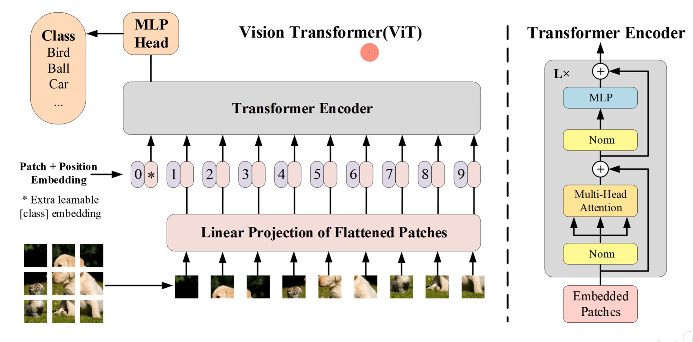


## ViT模型输入原理与代码

### PatchEmbed原理

**直观流程**

设定输入图像大小为224\*224\*3。把他们切成 大小为16*16\*3大小的patch块，一共切出来196块，将每一个patch块展平，就获得了196个768大小的一维向量，之后经过一个全连接神经网络赋予权重，仍然是196个768大小的一维向量


**工程流程**(代码中实际实现方式)

设定输入图像大小为224\*224\*3。卷积核大小为16\*16，卷积核数量为768，步幅为16，填充为0。经过卷积层后，获得14\*14\*768的矩阵。之后沿着 1\*1\*768方向展开，获得了196个1\*1\*768的小矩阵，也就是196个768大小的一维向量


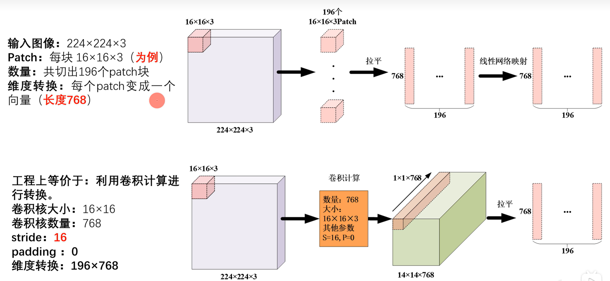


**卷积公式回忆：**

OH为输出高度，H输入高度，P是填充，FH为卷积核高度，S为步幅

$OH=\frac{H+2P-FH}{S}+1$


OW为输出宽度，W输入宽度，P是填充，FW为卷积核宽度，S为步幅

$OW=\frac{W+2P-FW}{S}+1$


**在拉平后通常要接上BN/LN**

**BN（Batch Normalization）**

**在每个通道上，跨 batch 和所有空间位置求均值和方差。**

- 对第 1 个通道（R）：把 **32 张图的 R 通道里所有的 224×224 个像素**（共 32×224×224 个数字）放在一起算均值和方差。
- 对第 2 个通道（G）：同样，只考虑 G 通道的所有像素。
- 对第 3 个通道（B）：同理。

**结果**：每个通道得到**一对**（μ, σ²），用来归一化该通道的所有位置。

------

**LN（Layer Normalization）**

**在每个样本上，跨所有通道和所有空间位置求均值和方差。**

- 对第 1 张图：把这张图的 **3 个通道 × 224×224 个像素**（共 3×224×224 个数字）放在一起算均值和方差。
- 对第 2 张图：同样，只考虑第 2 张图的所有像素。
- … 直到第 32 张图。

**结果**：每张图得到**一对**（μ, σ²），用来归一化该图的所有像素。


**BN/LN的代码理解**

**1. BatchNorm2d（批归一化）**

- **输入形状**：`(N, C, H, W)`
  - N：batch size
  - C：通道数
  - H、W：空间维度
- **归一化方式**：对**每个通道**，在 `(N, H, W)` 三个维度上计算均值和方差，然后归一化。
  即每个通道有一组独立的均值和方差，统计量依赖于 **batch 内的所有样本**和**空间位置**。
- **实例化**：`nn.BatchNorm2d(num_features)`，这里的 `num_features` 就是 `C`（通道数）。

**在代码中**，`norm_layer(embed_dim)` 如果传入 `nn.BatchNorm2d`，则 `embed_dim` 被当作 `num_features`，因为 `nn.BatchNorm2d.__init__(self, num_features, ...)` 的第一个参数就是通道数。所以 `norm_layer(embed_dim)` 创建了一个 `BatchNorm2d(embed_dim)` 实例。

------

**2. LayerNorm（层归一化）**

- **输入形状**：任意形状，但通常对最后一维（特征维）做归一化。
  常见输入：`(N, L, D)`（N：batch，L：序列长度，D：特征维度）
- **归一化方式**：对**每个样本**，在**特征维度**上计算均值和方差（即对最后一维），与 batch 大小无关。
- **实例化**：`nn.LayerNorm(normalized_shape)`，`normalized_shape` 可以是整数（表示最后一维大小），也可以是元组（表示最后几个维度）。

**在代码中**，如果 `norm_layer=nn.LayerNorm`，则 `norm_layer(embed_dim)` 会创建一个 `LayerNorm(embed_dim)`，表示对最后一维大小为 `embed_dim` 的输入进行归一化。


### PatchEmbed代码

```python
# 模型输入层
class PatchEmbed(nn.Module):
    def __init__(self,img_size=224,patch_size=16,in_c=3,embed_dim=768,norm_layer=None):
        """
        Patch嵌入层，也就是模型的输入部分
        :param img_size: 输入模型的大小(通常是224*224)
        :param patch_size: 切分的patch块的大小(通常是16*16)
        :param in_c: 输入通道数(通常是彩色图，因此通道数为3)
        :param embed_dim: 展平后一个向量的维度
        :param norm_layer:批归一化/层归一化
        """

        # 存储一下：图片宽高、patch块宽高
        self.img_size=(img_size,img_size)
        self.patch_size=(patch_size,patch_size)

        # 网格大小：一个图像一行有几个patch，一列有几个patch
        # 例如：224//16=14，因此grid_size=(14,14)
        self.grid_size=(self.img_size[0]//self.patch_size[0],self.img_size[1],self.patch_size[1])

        # patch总数量：网格grid_size的 长x宽(本例中 14*14=196)
        self.num_patches=self.grid_size[0]*self.grid_size[1]

        # 使用Conv2d 等价实现 "切 patch + 线性投影"
        self.proj=nn.Conv2d(in_channels=in_c,out_channels=embed_dim,kernel_size=patch_size,stride=patch_size)

        # 可选归一化层(有些实现会在patch embedding后 加LN/BN)
        self.norm=norm_layer(embed_dim) if norm_layer else nn.Identity()
        # nn.Identity是得到一个恒等映射层，相当于什么也不做

    def forward(self,x):
        # x输入的是一张图片，它的维度是[B,C,H,W]
        B, C, H, W=x.shape

        # ViT输入图像大小必须固定(通常长宽为224*224)，若不是则报错退出
        assert H==self.img_size[0] and W==self.img_size[1],\
                f'输入的图像尺寸({H}*{W})，不符合模型尺寸({self.img_size[0]}*{self.img_size[1]})'

        # 1) proj： [B,3,224,224] -> [B,768,14,14]
        # 2) flatten(2)：[B,768,14,14] -> [B,768,196]
        #    这个函数表示从索引2维度开始，将后续维度拉平为1个维度
        # 3) transpose(1,2)：[B,768,196] -> [B,196,768]
        #    把索引为1和2的维度互换，相当于把 token 维度放到中间，得到序列形式
        x = self.proj(x).flatten(2).transpose(1, 2)

        # norm：保持形状不变 [B,196,768]
        x = self.norm(x)
        return x
```


## 分类标记

### 分类标记原理

**cls token分类标记**

本质：一个大小为embed_dim的可学习向量c

1.随机初始化参数，维度与模型输入一致

2.每个batch复制同一个cls token(实际上所有batch都是同一个cls token)

3.通过反向传播进行参数更新


**分类标记具体实现**

1.初始化cls向量：创建可学习参数，假设维度为$1 \times 768$

2.构造输入序列：图像序列与cls向量做concat操作，获得$197 \times 768$大小的矩阵。该矩阵将输入位置编码层

3.ViT计算：输入数据经过ViT的位置编码层、Encoder层计算后，输出特征行形状不变，依旧为$197 \times 768$大小的矩阵

4.分类输出：取第0个token(cls输出)大小为$1 \times 768$的向量作为整图特征,输入全连接神经网络

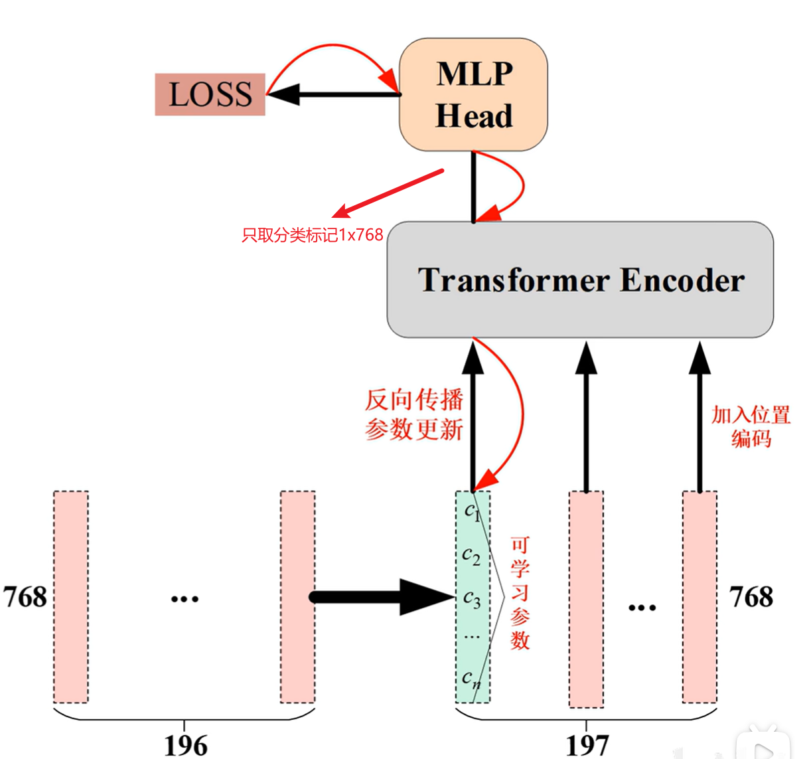


### 分类标记代码

**代码的实现：**

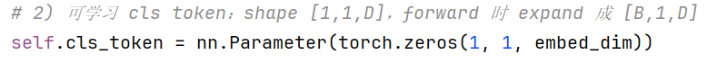

@@@@@@@@@@@@@@@@@@@@@@@@@@@

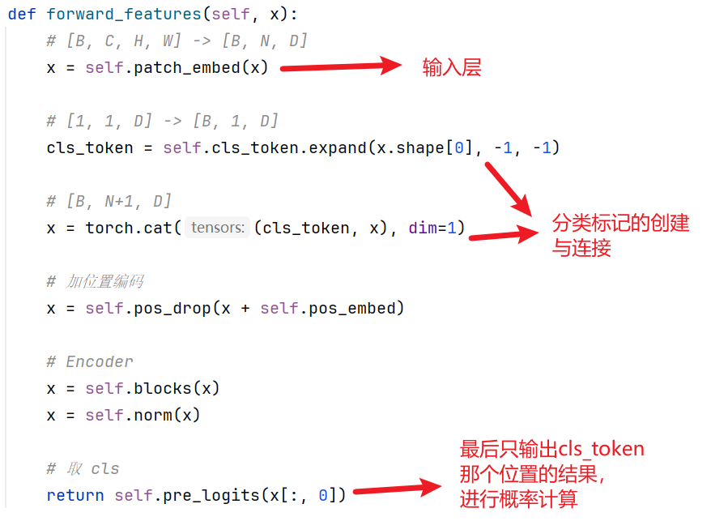


## 位置编码

### 位置编码原理

**ViT模型为什么需要位置编码**

ViT模型输入层把图像切成多个patch后，如果不额外告诉模型每个patch在图像中的位置，自注意力机制就无法识别空间结构。因此，我们可以发现，无论是Transformer还是ViT，他们的自注意力机制都是和位置编码绑定的，二者使用时缺一不可。


**ViT位置编码的使用策略**

论文中有实验证明 “**一维位置编码与ViT标准做法（尽在输入层后添加一个位置编码层）**”这种做法最好

有表格例子证据如下：

其中：

列 Pos.Emb表示位置编码类型；Default/Stem表示标准ViT位置编码做法；Every Layer表示在每个注意力机制层都加上位置编码做法；Every Layer-Shared表示在每个注意力机制层都加上位置编码，但是所有层共享一套位置编码参数。

行 No Pos.Emb表示完全不使用位置编码；1-D Pos.Emb表示一维位置编码，将2D图像展平为1D序列后添加位置信息；2-D Pos Emb表示二位位置编码，分别编码图像的行与列的位置，保留空间结构 ；Rel.Pos.Emb表示相对位置编码，建模token之间的相对位置关系而非绝对位置

我们可见 “1-D Pos.Emb+Default/Stem”效果最佳

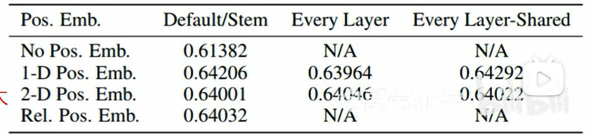


**ViT位置编码的具体实现**

此处的位置编码就是一个可学习矩阵，它的大小按照之前来说就是 $197 \times 768$。前向传播的时候直接与之前分类标记的输出相加即可（他们的大小都是一致的，都是$197 \times 768$）。

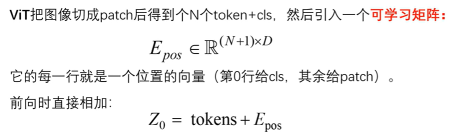

它的前向传播流程如下：

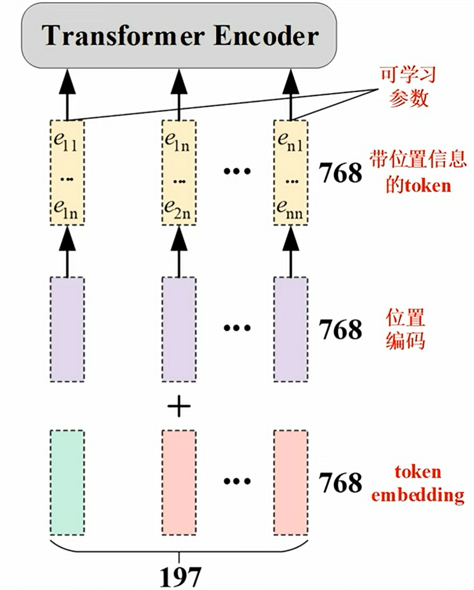


**ViT的位置编码与Transformer位置编码的区别**

Transformer的位置编码通过一个固定公式，ViT的位置编码通过一个自学习矩阵

因此ViT的这种位置编码更加灵活，更加能学习到多样的位置信息的，而不仅仅是相邻数字位置的关系


### 位置编码代码

**ViT位置编码的代码实现**

```python
...........
# 3) 可学习绝对位置编码：shape [1, N + num_tokens, D]
# 标准 ViT: [1, 197, 768]
self.pos_embed = nn.Parameter(torch.zeros(1, num_patches + 1, embed_dim))

# 对加了位置编码后的序列做dropout（随机失活）
self.pos_drop = nn.Dropout(p=drop_ratio)

..........

def forward_features(self, x):
    # [B, C, H, W] -> [B, N, D]
    x = self.patch_embed(x)

    # [1, 1, D] -> [B, 1, D]
    cls_token = self.cls_token.expand(x.shape[0], -1, -1)

    # [B, N+1, D]
    x = torch.cat((cls_token, x), dim=1)

    # 加位置编码(在此处实现位置编码的前向传播)
    x = self.pos_drop(x + self.pos_embed)

    # Encoder
    x = self.blocks(x)
    x = self.norm(x)

    # 取 cls
    return self.pre_logits(x[:, 0])

def forward(self, x):
    x = self.forward_features(x)
    x = self.head(x)
    return x

```


## 多头注意力机制

### 多头注意力机制原理


**编码器大致结构**

ViT的多头注意力机制大致结构与Transformer的多头注意力机制很想，只不过整体架构上使用了更加符合实践的结构，就是先进行批归一化、后进行前向传播运算，然后接上残差连接。

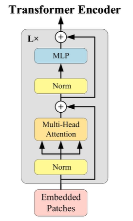


**多头注意力机制**

多头注意力机制大致结构。可以看见几乎和Transformer的多头注意力机制一摸一样。

**总体流程回忆回忆：**

输入的是一个大小为$L \times d$的矩阵，其中L对应之前patch个数179，d对应之前一个patch展平后的向量维度768。

将输入矩阵分别与大小为$d \times d_k$的可学习矩阵进行矩阵$W_i^q、W_i^k、W_i^v$相乘，获得大小为$L \times d_k$矩阵$Q_i、K_i、V_i$

$softmax(\frac{Q_iK_i^T}{\sqrt{d_k}})$获得了一个注意力机制矩阵，大小为 $L \times L$ 它的每一行中所有元素相加为1，表示当前行标对于各个列标的关联程度。

之后注意力矩阵与$V_i$矩阵进行矩阵相乘，大小变成 $L \times d_k$的矩阵，我们命名为$Z_i$。

8头结果矩阵$Z_i$在列的方向上连接，形成 $L \times 8d_k$ 的结果，最后与大小为$8d_k \times d$的矩阵$W_o$进行矩阵相乘进行权重映射，总体大小再次返回 $L \times d$（方便后续残差连接）

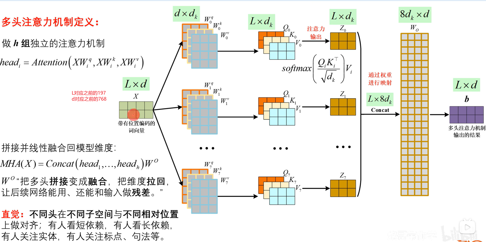


### 多头注意力机制代码

代码与原理图有些不大一样，但是总体来说实现的结果是一致的，原理图便于理解，代码专攻实践。

左半边是代码的模型结构图，右半边是原理的模型结构图


模型结构图如上所示：

隐藏关系:$d_k=d//h$，代码中$W_i^q、W_i^k、W_i^v$三个矩阵

```python
# 多头注意力机制代码
class Attention(nn.Module):
    def __init__(self,
                 dim,               # token embedding的维度d(对应原理中讲的768)
                 num_heads=8,       # 头数 h
                 qkv_bias=False,    # qkv 线性层是否带有偏执bias
                 qk_scale=None,     # 可选：自定义缩放因子，默认 1/sqrt(head_dim)
                 attn_drop_ratio=0.,# attention 权重dropout概率
                 proj_drop_ratio=0. # 输出投影dropout
                 ):
        super().__init__()

        self.num_heads=num_heads
        head_dim=dim//num_heads     # 每个头的维度dk=d//h(相当于dk=768//8=96)
        self.scale=qk_scale or head_dim**-0.5   # 缩放：1/sqrt(head_dim)

        # 一次线性层同时生成 Q,K,V（更高效）
        # 输入 [B,L,d] -> 输出 [B,L,3d]
        self.qkv = nn.Linear(dim, dim * 3, bias=qkv_bias)
        self.attn_drop = nn.Dropout(attn_drop_ratio)
        # 此处Q=Q0+Q1+...+Q7,K=K0+K1...+K7,V=V0+V1+...+V7

        # 多头 concat 后再做一次输出投影 Wo
        self.proj = nn.Linear(dim, dim)
        self.proj_drop = nn.Dropout(proj_drop_ratio)

    def forward(self, x):
        # x: [B, L, d]  L = patch数 + 1（cls），d = dim
        B, L, d = x.shape

        # 1) 生成 qkv: [B,L,3d]
        # 2) reshape: [B,L,3,dk,d]  (3d拆成：3、dk、d。dk = d/h)
        # 3) permute: [3,B,h,N,dk]  方便拆出 q,k,v
        qkv = self.qkv(x).reshape(B, L, 3, self.num_heads,
                                  d // self.num_heads).permute(2, 0, 3, 1, 4)
        # q,k,v: [B,h,L,dk]
        q, k, v = qkv[0], qkv[1], qkv[2]  # make torchscript happy (cannot use tensor as tuple)

        # 加权求和得到每个 token 的新表示：
        # attn @ v: [B,h,L,dk]
        # transpose: [B,L,h,dk]
        # reshape: [B,L,d]  (把多头拼回去)
        attn = (q @ k.transpose(-2, -1)) * self.scale  # q、k^T做矩阵相乘，并且缩放
        attn = attn.softmax(dim=-1)  # 对最后一维(列) L 做 softmax
        attn = self.attn_drop(attn)  # 随机失活之后，这里输出得就是注意力机制矩阵

        # 输出投影（对应 Wo）：[B,L,d] -> [B,L,d]
        x = (attn @ v).transpose(1, 2).reshape(B, L, d) # Z矩阵
        x = self.proj(x)        # Z矩阵与Wo做映射
        x = self.proj_drop(x)   # 随机失活
        return x
```


## 前馈神经网络

**ViT的主干部分**


ViT的主干部分由N个Encoder编码器组成，而一个编码器由多头自注意力机制、前馈神经网络组成

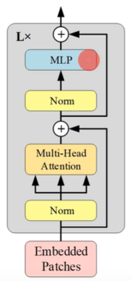


其中1个Encoder的输入矩阵形状变化如下：首先输入197x768大小的ptach embedds,经过层归一化LN后获得大小仍然是197x768，将它输入到多头注意力机制中，获得矩阵大小仍然是197x768，之后进行残差连接获得大小仍然是197x768的矩阵，将它输入层归一化LN后获得带下197x768矩阵，最后通过MLP获得197x768矩阵，最后通过残差连接完成编码器任务。总体而言，Encoder大框架下每一步输出都是197x768矩阵。

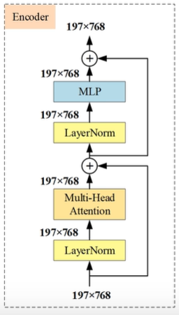


### 前馈神经网络原理

补充一点，Linear层的3072相当于4x768，作为2的倍数比较好进行计算


### 前馈神经网络代码

```python
# 前馈神经网络
class Mlp(nn.Module):
    """
    ViT的Encoder中的前馈神经网络Mlp
    前馈神经网络整体结果:Linear->GELU->Dropout->Linear->Dropout
    """
    def __init__(self,in_features,hidden_features=None,out_features=None,act_layer=nn.GELU,drop=0.):
        super().__init__()
        # 默认保持输入输出维度一致（残差连接要求）
        out_features = out_features or in_features
        hidden_features = hidden_features or in_features

        # 第1层：神经网络 Linear
        self.fc1=nn.Linear(in_features=in_features,out_features=hidden_features)
        # 第2层：GELU激活函数(ViT、BERT常用的激活函数)
        self.act=act_layer()
        # 第3层：神经网络 Linear
        self.fc2=nn.Linear(in_features=hidden_features,out_features=out_features)
        # 随机失活层
        self.drop=nn.Dropout(drop)

    def forward(self,x):
        # x:[B,L,d](L相当于原理中的197，d相当于原理中的768)
        x=self.fc1(x)
        x=self.act(x)
        x=self.drop(x)
        x=self.fc2(x)
        y=self.drop(x)
        return y
```


## 编码器

编码器对应代码中的`BLock`类


```python
class Block(nn.Module):
    """
    ViT中的Encoder 编码器
    结构：
        x=x+(多头注意力机制(LN(x)))
        x=x+(前馈神经网络(LN(x)))
    输入与输出前后形状不变 [B,L,d] L相当于原理中的197，d相当于原理中的768
    """
    def __init__(self,
                 dim,       # token的维度d(相当于原理中的768)
                 num_heads, # 多头注意力机制的头数
                 mlp_ratio=4.,  # 前馈神经网络MLP隐藏层扩展倍数(hidden = dim*mlp_ratio)
                 qkv_bias=False,
                 qk_scale=None,     # qk^T矩阵相乘后缩放比重，默认是 1/sqrt(dk)
                 drop_ratio=0.,     # Mlp随机失活比重
                 attn_drop_ratio=0.,# 注意力机制随机失活
                 act_layer=nn.GELU, # Mlp激活函数
                 norm_layer=nn.LayerNorm    # 归一化层默认为层归一化
                 ):
        super().__init__()

        # 1) 第一个 LN：给 Attention 前做归一化（Pre-LN）
        self.norm1 = norm_layer(dim)

        # 2) 多头自注意力：输入输出都是 [B,N,D]
        self.attn = Attention(dim, num_heads=num_heads, qkv_bias=qkv_bias, qk_scale=qk_scale,
                              attn_drop_ratio=attn_drop_ratio, proj_drop_ratio=drop_ratio)

        # 3) 第二个LN：给MLP前做归一化（Pre-LN）
        self.norm2 = norm_layer(dim)
        mlp_hidden_dim = int(dim * mlp_ratio)
        self.mlp = Mlp(in_features=dim, hidden_features=mlp_hidden_dim, act_layer=act_layer, drop=drop_ratio)

    def forward(self, x):
        # x: [B, N, D]
        # ---- Attention 子层 ----
        # LN: [B,N,D] -> [B,N,D]
        # MSA: [B,N,D] -> [B,N,D]
        # Residual: x + branch
        x = x + self.attn(self.norm1(x))

        # ---- MLP 子层 ----
        # LN: [B,N,D] -> [B,N,D]
        # MLP: [B,N,D] -> [B,N,D]
        x = x + self.mlp(self.norm2(x))
        return x
```


## ViT模型整体结构实现


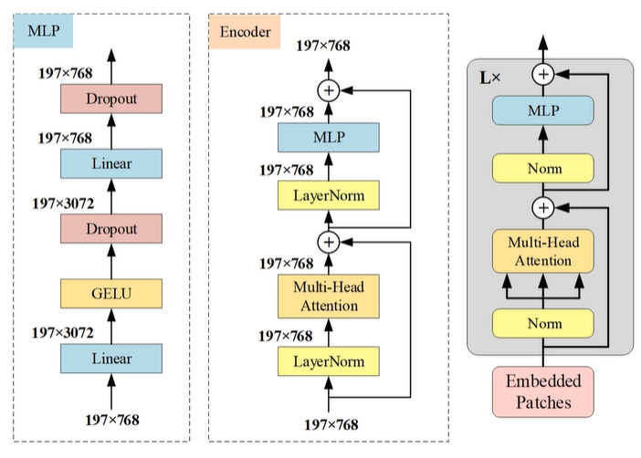


```python
def _init_vit_weights(m):
    """
    ViT 权重初始化（根据层类型分别初始化）
    m: 传入的子模块（apply 会遍历模型里所有子模块）
    """
    # 1) 线性层 Linear：trunc_normal 初始化权重，bias 全 0
    #   - trunc_normal：截断正态分布，避免极端大值，Transformer 中很常用
    if isinstance(m, nn.Linear):
        nn.init.trunc_normal_(m.weight, std=.01)   # 权重：N(0,0.01) 的截断版本
        if m.bias is not None:
            nn.init.zeros_(m.bias)                 # 偏置：0

    # 2) 卷积层 Conv2d：Kaiming 初始化（更适合 ReLU/卷积类）
    #   - 这里主要影响 PatchEmbed 那个 Conv2d（以及你若加 CNN stem）
    elif isinstance(m, nn.Conv2d):
        nn.init.kaiming_normal_(m.weight, mode="fan_out")
        if m.bias is not None:
            nn.init.zeros_(m.bias)

    # 3) LayerNorm：weight=1，bias=0（保证一开始是“标准化但不缩放/偏移”）
    elif isinstance(m, nn.LayerNorm):
        nn.init.zeros_(m.bias)
        nn.init.ones_(m.weight)


# ViT模型总框架
class VisionTransformer(nn.Module):
    def __init__(self,
                 img_size=224,  # 图片宽高
                 patch_size=16, # patch切块个数
                 in_c=3,        # 输入的通常是彩色图片，因此通道数为3
                 num_classes=1000,  # 分类数
                 embed_dim=768, # d表示patch展平后的特征维度
                 depth=12,      # Encoder编码器个数
                 num_heads=12,  # 多头注意力机制的头数
                 mlp_ratio=4.0, # 前馈神经网络MLP隐藏层扩展倍数(hidden = dim*mlp_ratio)
                 qkv_bias=True, # W^q、W^k、W^v矩阵形成前是否需要添加偏执
                 qk_scale=None, # qk^T矩阵相乘后缩放比重，默认是 1/sqrt(dk)
                 representation_size=None,
                 drop_ratio=0., # 前馈神经网络Mlp随机失活比重
                 attn_drop_ratio=0.,    # 注意力机制随机失活
                 embed_layer=PatchEmbed,# 模型输入层
                 norm_layer=None,       # 归一化层
                 act_layer=None         # 激活函数层
                 ):
        super().__init__()

        self.num_classes=num_classes
        self.num_features = self.embed_dim = embed_dim  # 这里num_features主要给分类头用（后面可能被 representation_size 改写）

        # 默认LayerNorm（eps=1e-6）和 GELU
        norm_layer = norm_layer or partial(nn.LayerNorm, eps=1e-6)
        act_layer = act_layer or nn.GELU

        if representation_size is None:
            representation_size = embed_dim

        # 1) Patch Embedding：图像 -> patch tokens
        # 输出：[B, N, D]，N=196（224/16=14, 14*14=196）
        self.patch_embed = embed_layer(img_size=img_size, patch_size=patch_size, in_c=in_c, embed_dim=embed_dim)
        num_patches = self.patch_embed.num_patches

        # 2) 可学习 cls token：shape [1,1,D]，forward 时 expand 成 [B,1,D]
        self.cls_token = nn.Parameter(torch.zeros(1, 1, embed_dim))

        # 3) 可学习绝对位置编码：shape [1, N + num_tokens, D]
        # 标准 ViT: [1, 197, 768]
        self.pos_embed = nn.Parameter(torch.zeros(1, num_patches + 1, embed_dim))

        # 对加了位置编码后的序列做dropout（正则）
        self.pos_drop = nn.Dropout(p=drop_ratio)

        # 5) Transformer Encoder：堆叠 depth 个 Block
        self.blocks = nn.Sequential(*[
            Block(dim=embed_dim, num_heads=num_heads, mlp_ratio=mlp_ratio, qkv_bias=qkv_bias, qk_scale=qk_scale,
                  drop_ratio=drop_ratio, attn_drop_ratio=attn_drop_ratio, norm_layer=norm_layer,
                  act_layer=act_layer)
            for _ in range(depth)])

        # 最后再做一次 LayerNorm（论文也有最后的 LN）
        self.norm = norm_layer(embed_dim)

        # 加一层 Linear + Tanh
        self.num_features = representation_size
        self.pre_logits = nn.Sequential(OrderedDict([
            ("fc", nn.Linear(embed_dim, representation_size)),
            ("act", nn.Tanh())
        ]))

        # 分类头：把特征映射到类别数 K
        self.head = nn.Linear(self.num_features, num_classes) if num_classes > 0 else nn.Identity()

        # Weight init：pos_embed / cls_token / dist_token 采用 trunc_normal(std=0.02)（常见 ViT 初始化）
        nn.init.trunc_normal_(self.pos_embed, std=0.02)
        nn.init.trunc_normal_(self.cls_token, std=0.02)
        # 对其它层按自定义 _init_vit_weights 初始化
        self.apply(_init_vit_weights)

    def forward_features(self, x):
        # [B, C, H, W] -> [B, N, D]
        x = self.patch_embed(x)

        # [1, 1, D] -> [B, 1, D]
        cls_token = self.cls_token.expand(x.shape[0], -1, -1)

        # [B, N+1, D]
        x = torch.cat((cls_token, x), dim=1)

        # 加位置编码
        x = self.pos_drop(x + self.pos_embed)

        # Encoder
        x = self.blocks(x)
        x = self.norm(x)

        # 取 cls
        return self.pre_logits(x[:, 0])

    def forward(self, x):
        x = self.forward_features(x)
        x = self.head(x)
        return x
```


## Base-Large-Huge三个版本的ViT

**ViT的Base、Large、Huge表格区别如下：**

Layers表示编码器个数，Hidden size D表示切分Patches时的卷积核个数，MLP size表示前馈神经网络中间层个数，Heads表示多头注意力机制的头数

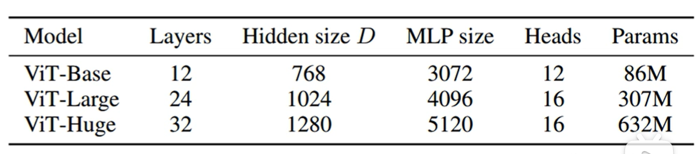


**对应的实例化代码如下：**

Base、Large、Huge各有两个版本，两个版本的区别在于patch切分时卷积核长宽一个是16，一个是32。

每个版本都有它们所对应的与训练权重，他们的链接已经放到注释中

实战部分使用`vit_base_patch16_224_in21k`

```python
def vit_base_patch16_224_in21k(num_classes: int = 21843):
    """
    ViT-Base model (ViT-B/16) from original paper (https://arxiv.org/abs/2010.11929).
    ImageNet-21k weights @ 224x224, source https://github.com/google-research/vision_transformer.
    weights ported from official Google JAX impl:
    https://github.com/rwightman/pytorch-image-models/releases/download/v0.1-vitjx/jx_vit_base_patch16_224_in21k-e5005f0a.pth
    """
    model = VisionTransformer(img_size=224,
                              patch_size=16,
                              embed_dim=768,
                              depth=12,
                              num_heads=12,
                              representation_size=768,
                              num_classes=num_classes)
    return model


def vit_base_patch32_224_in21k(num_classes: int = 21843):
    """
    ViT-Base model (ViT-B/32) from original paper (https://arxiv.org/abs/2010.11929).
    ImageNet-21k weights @ 224x224, source https://github.com/google-research/vision_transformer.
    weights ported from official Google JAX impl:
    https://github.com/rwightman/pytorch-image-models/releases/download/v0.1-vitjx/jx_vit_base_patch32_224_in21k-8db57226.pth
    """
    model = VisionTransformer(img_size=224,
                              patch_size=32,
                              embed_dim=768,
                              depth=12,
                              num_heads=12,
                              representation_size=768,
                              num_classes=num_classes)
    return model


def vit_large_patch16_224_in21k(num_classes: int = 21843):
    """
    ViT-Large model (ViT-L/16) from original paper (https://arxiv.org/abs/2010.11929).
    ImageNet-21k weights @ 224x224, source https://github.com/google-research/vision_transformer.
    weights ported from official Google JAX impl:
    https://github.com/rwightman/pytorch-image-models/releases/download/v0.1-vitjx/jx_vit_large_patch16_224_in21k-606da67d.pth
    """
    model = VisionTransformer(img_size=224,
                              patch_size=16,
                              embed_dim=1024,
                              depth=24,
                              num_heads=16,
                              representation_size=1024,
                              num_classes=num_classes)
    return model


def vit_large_patch32_224_in21k(num_classes: int = 21843):
    """
    ViT-Large model (ViT-L/32) from original paper (https://arxiv.org/abs/2010.11929).
    ImageNet-21k weights @ 224x224, source https://github.com/google-research/vision_transformer.
    weights ported from official Google JAX impl:
    https://github.com/rwightman/pytorch-image-models/releases/download/v0.1-vitjx/jx_vit_large_patch32_224_in21k-9046d2e7.pth
    """
    model = VisionTransformer(img_size=224,
                              patch_size=32,
                              embed_dim=1024,
                              depth=24,
                              num_heads=16,
                              representation_size=1024,
                              num_classes=num_classes)
    return model


def vit_huge_patch14_224_in21k(num_classes: int = 21843):
    """
    ViT-Huge model (ViT-H/14) from original paper (https://arxiv.org/abs/2010.11929).
    ImageNet-21k weights @ 224x224, source https://github.com/google-research/vision_transformer.
    NOTE: converted weights not currently available, too large for github release hosting.
    """
    model = VisionTransformer(img_size=224,
                              patch_size=14,
                              embed_dim=1280,
                              depth=32,
                              num_heads=16,
                              representation_size=1280,
                              num_classes=num_classes)
    return model
```


# 具体实践项目

基于ViT的植物病害识别：https://github.com/hide-self/myViT_PlantLeafDisease_Classify


